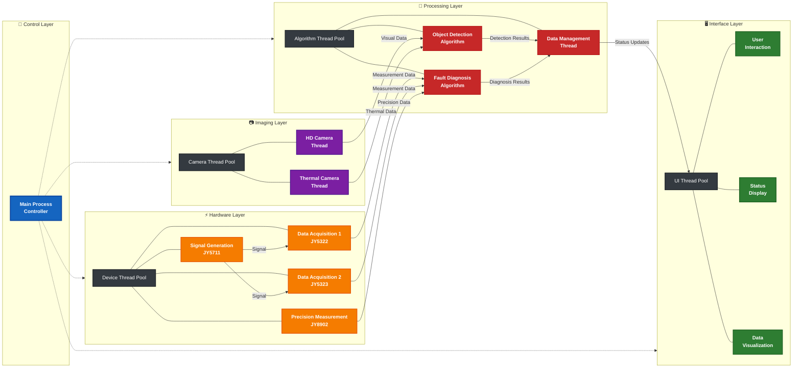
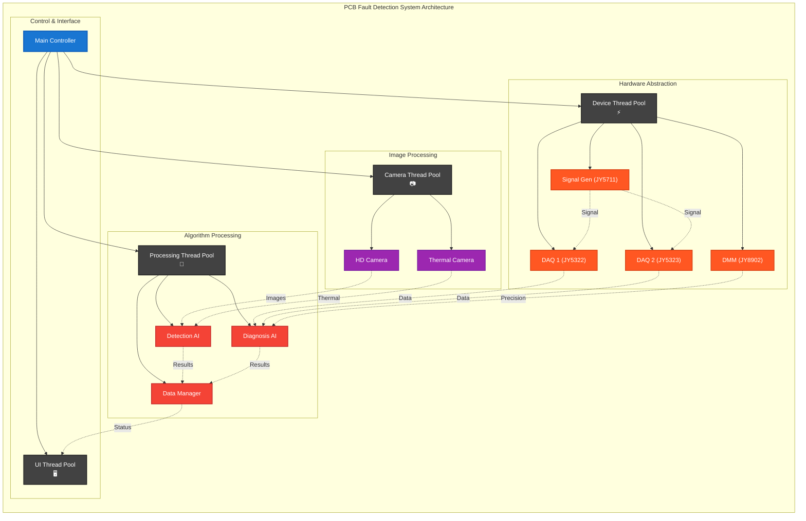

# PCB Fault Detection System - Multi-threaded Architecture

## System Threading Architecture Diagram

```mermaid
flowchart LR
    subgraph MainSystem["🔧 PCB Fault Detection System"]
        direction TB
        
        subgraph MainController["🎯 Main Controller"]
            MT["Main Process<br/>Controller"]
        end
        
        subgraph UILayer["🖥️ User Interface Layer"]
            direction TB
            UI["UI Management<br/>Thread"]
            UIA["User Interaction<br/>Handler"]
            UIB["Real-time Status<br/>Display"]
            UIC["Result<br/>Visualization"]
            
            UI --- UIA
            UI --- UIB
            UI --- UIC
        end
        
        subgraph HardwareLayer["⚡ Hardware Abstraction Layer"]
            direction TB
            DTP["Device Thread<br/>Manager"]
            
            subgraph SignalGen["📡 Signal Generation"]
                AO["AO Thread<br/>JY5711"]
                AO1["Signal<br/>Configuration"]
                AO2["Waveform<br/>Output"]
                AO3["Status<br/>Monitoring"]
                
                AO --- AO1
                AO --- AO2
                AO --- AO3
            end
            
            subgraph DataAcq["📊 Data Acquisition"]
                DAQ1["DAQ Thread 1<br/>JY5322"]
                DAQ2["DAQ Thread 2<br/>JY5323"]
                
                subgraph DAQ1Sub["DAQ1 Functions"]
                    DAQ1A["Data<br/>Acquisition"]
                    DAQ1B["Buffer<br/>Management"]
                    DAQ1C["Sync<br/>Triggering"]
                end
                
                subgraph DAQ2Sub["DAQ2 Functions"]
                    DAQ2A["Data<br/>Acquisition"]
                    DAQ2B["Buffer<br/>Management"]
                    DAQ2C["Sync<br/>Triggering"]
                end
                
                DAQ1 --- DAQ1Sub
                DAQ2 --- DAQ2Sub
            end
            
            subgraph PrecisionMeas["🎯 Precision Measurement"]
                DMM["DMM Thread<br/>JY8902"]
                DMM1["Precision<br/>Measurement"]
                DMM2["Parameter<br/>Analysis"]
                DMM3["Result<br/>Reporting"]
                
                DMM --- DMM1
                DMM --- DMM2
                DMM --- DMM3
            end
            
            DTP --- SignalGen
            DTP --- DataAcq
            DTP --- PrecisionMeas
        end
        
        subgraph ImageLayer["📷 Image Processing Layer"]
            direction TB
            CTP["Camera Thread<br/>Manager"]
            
            subgraph VisualSensor["👁️ Visual Sensors"]
                HDC["HD Camera<br/>Thread"]
                HDC1["Image<br/>Acquisition"]
                HDC2["Image<br/>Preprocessing"]
                HDC3["Feature<br/>Extraction"]
                
                HDC --- HDC1
                HDC --- HDC2
                HDC --- HDC3
            end
            
            subgraph ThermalSensor["🌡️ Thermal Sensors"]
                TIR["Thermal Camera<br/>Thread"]
                TIR1["Thermal<br/>Acquisition"]
                TIR2["Temperature<br/>Calibration"]
                TIR3["Hotspot<br/>Analysis"]
                
                TIR --- TIR1
                TIR --- TIR2
                TIR --- TIR3
            end
            
            CTP --- VisualSensor
            CTP --- ThermalSensor
        end
        
        subgraph ProcessingLayer["🧠 Algorithm Processing Layer"]
            direction TB
            PTP["Processing Thread<br/>Manager"]
            
            subgraph AIAlgorithms["🤖 AI Algorithms"]
                ALG1["Detection<br/>Algorithm"]
                ALG2["Diagnosis<br/>Algorithm"]
                
                subgraph ALG1Sub["Detection Tasks"]
                    ALG1A["Object<br/>Detection"]
                    ALG1B["Feature<br/>Matching"]
                    ALG1C["Result<br/>Output"]
                end
                
                subgraph ALG2Sub["Diagnosis Tasks"]
                    ALG2A["Fault<br/>Diagnosis"]
                    ALG2B["Parameter<br/>Analysis"]
                    ALG2C["Decision<br/>Fusion"]
                end
                
                ALG1 --- ALG1Sub
                ALG2 --- ALG2Sub
            end
            
            subgraph DataMgmt["💾 Data Management"]
                DM["Data Manager<br/>Thread"]
                DM1["Data<br/>Storage"]
                DM2["Report<br/>Generation"]
                DM3["Historical<br/>Query"]
                
                DM --- DM1
                DM --- DM2
                DM --- DM3
            end
            
            PTP --- AIAlgorithms
            PTP --- DataMgmt
        end
        
        %% Main Connections
        MT -.-> UILayer
        MT -.-> HardwareLayer
        MT -.-> ImageLayer
        MT -.-> ProcessingLayer
    end
    
    %% Data Flow Connections
    AO -.->|"Signal Generation"| DAQ1
    AO -.->|"Signal Generation"| DAQ2
    DAQ1 -.->|"Measurement Data"| ALG2
    DAQ2 -.->|"Measurement Data"| ALG2
    DMM -.->|"Precision Data"| ALG2
    HDC -.->|"Visual Data"| ALG1
    TIR -.->|"Thermal Data"| ALG1
    ALG1 -.->|"Detection Results"| DM
    ALG2 -.->|"Diagnosis Results"| DM
    DM -.->|"Status Updates"| UI
    
    %% Enhanced Styling
    classDef mainController fill:#1e3a8a,color:#ffffff,stroke:#1e40af,stroke-width:3px
    classDef uiLayer fill:#059669,color:#ffffff,stroke:#047857,stroke-width:2px
    classDef hardwareLayer fill:#dc2626,color:#ffffff,stroke:#b91c1c,stroke-width:2px
    classDef imageLayer fill:#7c3aed,color:#ffffff,stroke:#6d28d9,stroke-width:2px
    classDef processLayer fill:#ea580c,color:#ffffff,stroke:#c2410c,stroke-width:2px
    classDef subComponents fill:#f3f4f6,color:#374151,stroke:#6b7280,stroke-width:1px
    classDef manager fill:#374151,color:#ffffff,stroke:#111827,stroke-width:2px
    
    class MT mainController
    class UI,UIA,UIB,UIC uiLayer
    class DTP manager
    class AO,DAQ1,DAQ2,DMM hardwareLayer
    class CTP manager
    class HDC,TIR imageLayer
    class PTP manager
    class ALG1,ALG2,DM processLayer
    class AO1,AO2,AO3,DAQ1A,DAQ1B,DAQ1C,DAQ2A,DAQ2B,DAQ2C,DMM1,DMM2,DMM3 subComponents
    class HDC1,HDC2,HDC3,TIR1,TIR2,TIR3 subComponents
    class ALG1A,ALG1B,ALG1C,ALG2A,ALG2B,ALG2C,DM1,DM2,DM3 subComponents
```

## Simplified Academic Version for Papers

## Compact Version for Technical Documentation

## Thread Communication Matrix

| Thread Type | Communication Method | Synchronization | Data Exchange |
|-------------|---------------------|-----------------|---------------|
| UI ↔ Main | Qt Signals/Slots | Event-driven | Status Updates |
| Device ↔ Processing | Thread-safe Queues | Mutex & Condition Variables | Measurement Data |
| Camera ↔ Algorithm | Shared Memory | Semaphores | Image Buffers |
| Algorithm ↔ Data Mgmt | Producer-Consumer | Lock-free Queues | Analysis Results |

## Performance Characteristics

| Component | Thread Count | CPU Utilization | Memory Usage | Latency |
|-----------|-------------|-----------------|--------------|---------|
| Device Pool | 4 | 15-25% | 64MB | <10ms |
| Camera Pool | 2 | 20-30% | 128MB | <50ms |
| Processing Pool | 3 | 60-80% | 256MB | <200ms |
| UI Thread | 1 | 5-10% | 32MB | <16ms |
