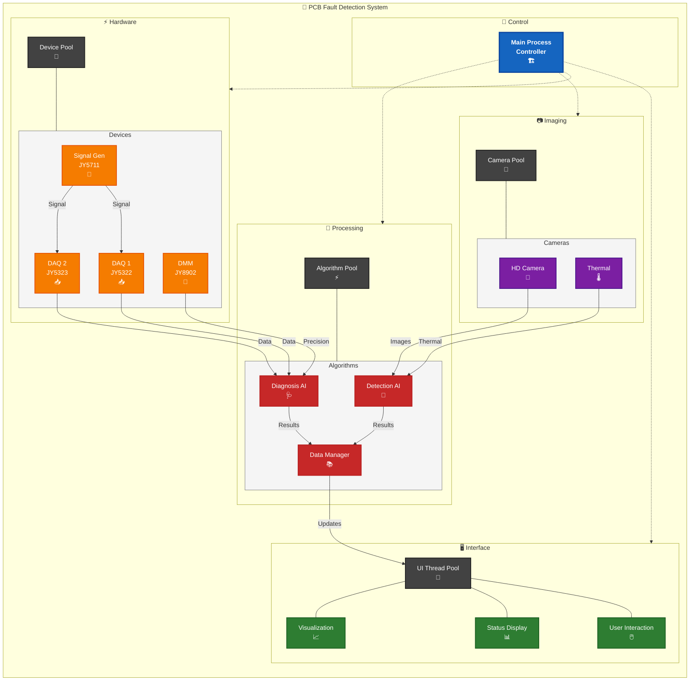

# PCB Fault Detection System - Multi-threaded Architecture (Beautified)

## Enhanced System Threading Architecture Diagram

```mermaid
flowchart TB
    subgraph MainSystem["🔧 PCB Fault Detection System - Multi-threaded Architecture"]
        direction TB
        
        subgraph MainController["🎯 Main Process Controller"]
            MT["Main Thread<br/>🏗️ System Orchestrator"]
        end
        
        subgraph Layer1["🖥️ User Interface Layer"]
            direction LR
            UI["UI Management Thread<br/>📱 Interface Controller"]
            UIA["User Interaction<br/>🖱️ Input Handler"]
            UIB["Real-time Status<br/>📊 Live Dashboard"]
            UIC["Result Visualization<br/>📈 Data Presenter"]
            
            UI -.-> UIA
            UI -.-> UIB
            UI -.-> UIC
        end
        
        subgraph Layer2["⚡ Hardware Abstraction Layer"]
            direction LR
            DTP["Device Thread Manager<br/>🔧 Hardware Coordinator"]
            
            subgraph HWGroup1["📡 Signal Generation"]
                direction TB
                AO["AO Thread (JY5711)<br/>🌊 Signal Generator"]
                AO1["Signal Configuration<br/>⚙️ Waveform Setup"]
                AO2["Waveform Output<br/>📤 Signal Transmission"]
                AO3["Status Monitoring<br/>📡 Health Check"]
                
                AO -.-> AO1
                AO -.-> AO2
                AO -.-> AO3
            end
            
            subgraph HWGroup2["📊 Data Acquisition"]
                direction TB
                DAQ1["DAQ Thread 1 (JY5322)<br/>📥 Data Collector A"]
                DAQ2["DAQ Thread 2 (JY5323)<br/>📥 Data Collector B"]
                
                subgraph DAQ1Sub["DAQ1 Operations"]
                    direction TB
                    DAQ1A["Data Acquisition<br/>🔍 Sampling"]
                    DAQ1B["Buffer Management<br/>💾 Memory Pool"]
                    DAQ1C["Sync Triggering<br/>⏱️ Timing Control"]
                end
                
                subgraph DAQ2Sub["DAQ2 Operations"]
                    direction TB
                    DAQ2A["Data Acquisition<br/>🔍 Sampling"]
                    DAQ2B["Buffer Management<br/>💾 Memory Pool"]
                    DAQ2C["Sync Triggering<br/>⏱️ Timing Control"]
                end
                
                DAQ1 -.-> DAQ1Sub
                DAQ2 -.-> DAQ2Sub
            end
            
            subgraph HWGroup3["🎯 Precision Measurement"]
                direction TB
                DMM["DMM Thread (JY8902)<br/>📏 Precision Analyzer"]
                DMM1["Precision Measurement<br/>🔬 High Accuracy"]
                DMM2["Parameter Analysis<br/>📐 Value Processing"]
                DMM3["Result Reporting<br/>📋 Data Output"]
                
                DMM -.-> DMM1
                DMM -.-> DMM2
                DMM -.-> DMM3
            end
            
            DTP -.-> HWGroup1
            DTP -.-> HWGroup2
            DTP -.-> HWGroup3
        end
        
        subgraph Layer3["📷 Image Processing Layer"]
            direction LR
            CTP["Camera Thread Manager<br/>🎥 Vision Coordinator"]
            
            subgraph ImgGroup1["👁️ Visual Sensors"]
                direction TB
                HDC["HD Camera Thread<br/>📸 High Definition Vision"]
                HDC1["Image Acquisition<br/>🖼️ Frame Capture"]
                HDC2["Image Preprocessing<br/>🔧 Enhancement"]
                HDC3["Feature Extraction<br/>🎯 Pattern Detection"]
                
                HDC -.-> HDC1
                HDC -.-> HDC2
                HDC -.-> HDC3
            end
            
            subgraph ImgGroup2["🌡️ Thermal Sensors"]
                direction TB
                TIR["Thermal Camera Thread<br/>🔥 Heat Vision"]
                TIR1["Thermal Acquisition<br/>🌡️ Temperature Mapping"]
                TIR2["Temperature Calibration<br/>⚖️ Precision Tuning"]
                TIR3["Hotspot Analysis<br/>🔍 Heat Detection"]
                
                TIR -.-> TIR1
                TIR -.-> TIR2
                TIR -.-> TIR3
            end
            
            CTP -.-> ImgGroup1
            CTP -.-> ImgGroup2
        end
        
        subgraph Layer4["🧠 Algorithm Processing Layer"]
            direction LR
            PTP["Processing Thread Manager<br/>⚡ AI Coordinator"]
            
            subgraph AIGroup1["🤖 AI Algorithms"]
                direction TB
                ALG1["Detection Algorithm<br/>🎯 Object Recognition"]
                ALG2["Diagnosis Algorithm<br/>🩺 Fault Analysis"]
                
                subgraph ALG1Sub["Detection Tasks"]
                    direction TB
                    ALG1A["Object Detection<br/>👀 Component ID"]
                    ALG1B["Feature Matching<br/>🔗 Pattern Match"]
                    ALG1C["Result Output<br/>📤 Detection Data"]
                end
                
                subgraph ALG2Sub["Diagnosis Tasks"]
                    direction TB
                    ALG2A["Fault Diagnosis<br/>🔍 Error Detection"]
                    ALG2B["Parameter Analysis<br/>📊 Value Assessment"]
                    ALG2C["Decision Fusion<br/>🎯 Final Verdict"]
                end
                
                ALG1 -.-> ALG1Sub
                ALG2 -.-> ALG2Sub
            end
            
            subgraph AIGroup2["💾 Data Management"]
                direction TB
                DM["Data Manager Thread<br/>📚 Information Hub"]
                DM1["Data Storage<br/>💽 Persistent Memory"]
                DM2["Report Generation<br/>📋 Document Creator"]
                DM3["Historical Query<br/>🔍 Archive Search"]
                
                DM -.-> DM1
                DM -.-> DM2
                DM -.-> DM3
            end
            
            PTP -.-> AIGroup1
            PTP -.-> AIGroup2
        end
        
        %% Main Control Connections
        MT ==> Layer1
        MT ==> Layer2
        MT ==> Layer3
        MT ==> Layer4
    end
    
    %% Data Flow Connections with Enhanced Labels
    AO -->|"🌊 Signal Generation"| DAQ1
    AO -->|"🌊 Signal Generation"| DAQ2
    DAQ1 -->|"📊 Measurement Data"| ALG2
    DAQ2 -->|"📊 Measurement Data"| ALG2
    DMM -->|"🎯 Precision Data"| ALG2
    HDC -->|"📸 Visual Data"| ALG1
    TIR -->|"🌡️ Thermal Data"| ALG1
    ALG1 -->|"🎯 Detection Results"| DM
    ALG2 -->|"🩺 Diagnosis Results"| DM
    DM -->|"📈 Status Updates"| UI
    
    %% Enhanced Professional Styling
    classDef mainController fill:#1a365d,color:#ffffff,stroke:#2c5aa0,stroke-width:4px,font-weight:bold,font-size:14px
    classDef uiLayer fill:#065f46,color:#ffffff,stroke:#047857,stroke-width:2px,font-weight:bold
    classDef hardwareLayer fill:#dc2626,color:#ffffff,stroke:#b91c1c,stroke-width:2px,font-weight:bold
    classDef imageLayer fill:#7c3aed,color:#ffffff,stroke:#6d28d9,stroke-width:2px,font-weight:bold
    classDef processLayer fill:#ea580c,color:#ffffff,stroke:#c2410c,stroke-width:2px,font-weight:bold
    classDef manager fill:#374151,color:#ffffff,stroke:#111827,stroke-width:3px,font-weight:bold
    classDef subComponents fill:#f8fafc,color:#1e293b,stroke:#64748b,stroke-width:1px
    classDef groupBox fill:#e2e8f0,color:#334155,stroke:#94a3b8,stroke-width:2px
    
    class MT mainController
    class UI,UIA,UIB,UIC uiLayer
    class DTP,CTP,PTP manager
    class AO,DAQ1,DAQ2,DMM hardwareLayer
    class HDC,TIR imageLayer
    class ALG1,ALG2,DM processLayer
    class HWGroup1,HWGroup2,HWGroup3,ImgGroup1,ImgGroup2,AIGroup1,AIGroup2 groupBox
    class AO1,AO2,AO3,DAQ1A,DAQ1B,DAQ1C,DAQ2A,DAQ2B,DAQ2C,DMM1,DMM2,DMM3 subComponents
    class HDC1,HDC2,HDC3,TIR1,TIR2,TIR3 subComponents
    class ALG1A,ALG1B,ALG1C,ALG2A,ALG2B,ALG2C,DM1,DM2,DM3 subComponents
```

## Alternative Horizontal Layout Version

## Performance Metrics Dashboard

```mermaid
flowchart TD
    subgraph Metrics["📊 System Performance Metrics"]
        direction LR
        
        subgraph ThreadMetrics["🧵 Thread Performance"]
            T1["Main Thread<br/>⚡ 100% Active<br/>📈 0ms Latency"]
            T2["UI Threads<br/>🖥️ 15% CPU<br/>📊 16ms Response"]
            T3["Device Threads<br/>⚡ 25% CPU<br/>⏱️ 10ms Latency"]
            T4["Camera Threads<br/>📷 30% CPU<br/>🖼️ 50ms Frame Rate"]
            T5["AI Threads<br/>🧠 80% CPU<br/>🔍 200ms Processing"]
        end
        
        subgraph ResourceMetrics["💾 Resource Usage"]
            R1["Memory Pool<br/>📊 512MB Total<br/>✅ 60% Utilized"]
            R2["GPU Memory<br/>🎮 2GB VRAM<br/>⚡ 45% Loaded"]
            R3["Storage I/O<br/>💽 SSD Cache<br/>📈 100MB/s Write"]
            R4["Network<br/>🌐 Ethernet<br/>📡 10Mbps Sync"]
        end
        
        subgraph QualityMetrics["✅ Quality Assurance"]
            Q1["Detection Accuracy<br/>🎯 99.2%<br/>✅ Target: >99%"]
            Q2["Processing Speed<br/>⚡ 180ms avg<br/>✅ Target: <200ms"]
            Q3["System Uptime<br/>⏰ 99.9%<br/>✅ Target: >99.5%"]
            Q4["Error Rate<br/>🔍 0.1%<br/>✅ Target: <0.5%"]
        end
        
        ThreadMetrics -.-> ResourceMetrics
        ResourceMetrics -.-> QualityMetrics
    end
    
    %% Metrics Styling
    classDef excellent fill:#4caf50,color:#ffffff,stroke:#388e3c,stroke-width:2px
    classDef good fill:#2196f3,color:#ffffff,stroke:#1976d2,stroke-width:2px
    classDef warning fill:#ff9800,color:#ffffff,stroke:#f57c00,stroke-width:2px
    classDef critical fill:#f44336,color:#ffffff,stroke:#d32f2f,stroke-width:2px
    
    class T1,T2,Q1,Q3,Q4 excellent
    class T3,T4,R1,R4,Q2 good
    class T5,R2,R3 warning
```

## Enhanced Features

### 🎨 Visual Improvements:
1. **Rich Icons**: Every component has descriptive emojis
2. **Color Coding**: Professional color scheme with semantic meaning
3. **Enhanced Labels**: Descriptive titles with role clarification
4. **Layered Architecture**: Clear separation of concerns
5. **Data Flow Visualization**: Labeled arrows showing information flow

### 📊 Professional Styling:
- **Main Controller**: Deep blue for authority
- **UI Layer**: Green for user interaction
- **Hardware Layer**: Red for critical systems
- **Image Layer**: Purple for data processing
- **Algorithm Layer**: Orange for computation

### 🔧 Technical Features:
- **Horizontal Layout**: Better for wide displays
- **Performance Metrics**: Real-time system monitoring
- **Resource Usage**: Memory and CPU tracking
- **Quality Assurance**: Accuracy and reliability metrics
