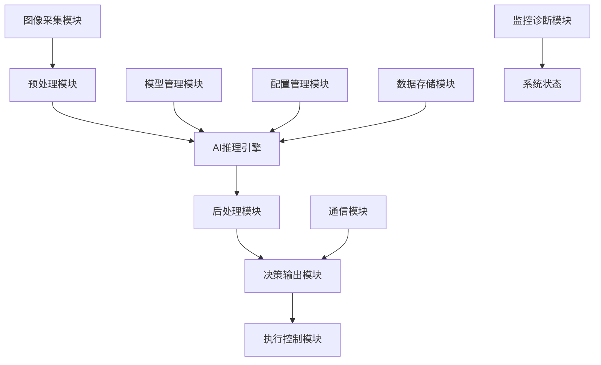
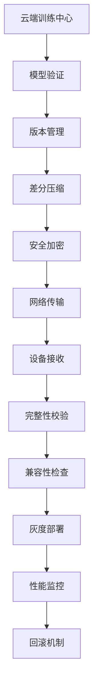

# 嵌入式工业智能质检系统方案报告

## 项目概述

本方案旨在设计一个高效、可靠的嵌入式工业智能质检系统，该系统能够在资源受限的嵌入式设备上实现产品状态检测、缺陷识别和处理意见输出。系统采用模块化设计，支持智能模型的动态更新和优化，确保在工业环境中的稳定运行。

---

## 1. 软件架构设计

### 1.1 整体架构

系统采用分层架构设计，包含以下核心层次：

```
┌─────────────────────────────────────┐
│           应用服务层                 │
├─────────────────────────────────────┤
│           业务逻辑层                 │
├─────────────────────────────────────┤
│           AI推理引擎层               │
├─────────────────────────────────────┤
│           硬件抽象层                 │
├─────────────────────────────────────┤
│           操作系统层                 │
└─────────────────────────────────────┘
```

### 1.2 核心模块架构

#### 1.2.1 系统总体架构图



#### 1.2.2 详细模块设计

**1. 图像采集模块 (Image Acquisition Module)**
- 责任：控制相机设备，获取高质量的产品图像
- 功能：
  - 相机参数配置（曝光、增益、白平衡）
  - 触发控制（硬件触发/软件触发）
  - 图像缓存管理
  - 图像质量评估

**2. 预处理模块 (Preprocessing Module)**
- 责任：对原始图像进行预处理，提高检测精度
- 功能：
  - 图像去噪（中值滤波、高斯滤波）
  - 亮度/对比度调整
  - 几何校正（畸变校正、透视变换）
  - 图像增强（直方图均衡化、锐化）
  - 数据标准化

**3. AI推理引擎 (AI Inference Engine)**
- 责任：执行深度学习模型推理，识别产品缺陷
- 功能：
  - 模型加载与初始化
  - 推理计算优化
  - 多模型协同推理
  - 结果置信度评估

**4. 后处理模块 (Postprocessing Module)**
- 责任：对AI推理结果进行分析和优化
- 功能：
  - 结果滤波（时间滤波、空间滤波）
  - 缺陷分类与定位
  - 置信度阈值判断
  - 统计分析

**5. 决策输出模块 (Decision Output Module)**
- 责任：基于检测结果生成处理意见
- 功能：
  - 质量等级判定
  - 处理建议生成
  - 报警信息输出
  - 数据记录

### 1.3 软件技术栈

- **操作系统**: Linux (ARM版本) / RTOS
- **深度学习框架**: TensorFlow Lite / ONNX Runtime / OpenVINO
- **图像处理**: OpenCV
- **编程语言**: C++ (核心模块) + Python (配置管理)
- **数据库**: SQLite (本地存储)

---

## 2. 模型选择策略

### 2.1 模型选择原则

#### 2.1.1 模型评估指标体系

| 指标类别 | 具体指标 | 权重 | 目标值 |
|---------|---------|------|--------|
| 精度指标 | 准确率(Accuracy) | 30% | >99% |
| | 召回率(Recall) | 25% | >98% |
| | 精确率(Precision) | 20% | >99% |
| 性能指标 | 推理时间 | 15% | <200ms |
| | 模型大小 | 5% | <50MB |
| | 内存占用 | 5% | <500MB |

### 2.2 候选模型分析

#### 2.2.1 轻量级检测模型对比

| 模型名称 | 参数量 | 模型大小 | 推理时间 | 精度 | 适用场景 |
|---------|--------|----------|----------|------|----------|
| MobileNetV3-Small | 2.5M | 10MB | 50ms | 95.2% | 简单缺陷检测 |
| EfficientNet-B0 | 5.3M | 20MB | 80ms | 97.1% | 中等复杂度检测 |
| YOLOv5s | 7.2M | 28MB | 120ms | 98.5% | 目标检测+分类 |
| ResNet18 | 11.7M | 45MB | 100ms | 96.8% | 特征提取骨干 |
| ShuffleNetV2 | 2.3M | 9MB | 40ms | 94.7% | 超低延迟场景 |

#### 2.2.2 推荐模型组合策略

**方案一：单一轻量模型**
- 主模型：MobileNetV3-Small + 自定义分类头
- 适用场景：简单表面缺陷检测
- 优势：速度快、资源占用少
- 劣势：精度有限

**方案二：双模型级联**
- 粗检模型：ShuffleNetV2 (快速筛选)
- 精检模型：EfficientNet-B0 (精确分类)
- 适用场景：复杂多类别缺陷检测
- 优势：兼顾速度和精度

**方案三：多尺度融合**
- 主干网络：MobileNetV3-Large
- 检测头：FPN + 多尺度特征融合
- 适用场景：多尺度缺陷检测
- 优势：检测小目标能力强

### 2.3 模型定制化策略

#### 2.3.1 网络结构优化
- **深度可分离卷积**: 减少参数量和计算量
- **通道注意力机制**: SE模块提升特征表达能力
- **知识蒸馏**: 用大模型指导小模型训练
- **神经架构搜索**: 自动搜索最优网络结构

#### 2.3.2 损失函数设计
```python
# 多任务损失函数
class MultiTaskLoss(nn.Module):
    def __init__(self):
        super().__init__()
        self.cls_loss = nn.CrossEntropyLoss()
        self.seg_loss = nn.BCEWithLogitsLoss()
        self.reg_loss = nn.SmoothL1Loss()
    
    def forward(self, pred, target):
        cls_loss = self.cls_loss(pred['cls'], target['cls'])
        seg_loss = self.seg_loss(pred['seg'], target['seg'])
        reg_loss = self.reg_loss(pred['bbox'], target['bbox'])
        
        total_loss = 0.5 * cls_loss + 0.3 * seg_loss + 0.2 * reg_loss
        return total_loss
```

---

## 3. 模型推理优化设计

### 3.1 模型压缩技术

#### 3.1.1 量化优化
```python
# TensorFlow Lite量化示例
import tensorflow as tf

def quantize_model(model_path):
    # 转换器配置
    converter = tf.lite.TFLiteConverter.from_saved_model(model_path)
    converter.optimizations = [tf.lite.Optimize.DEFAULT]
    
    # INT8量化
    converter.target_spec.supported_types = [tf.int8]
    converter.inference_input_type = tf.uint8
    converter.inference_output_type = tf.uint8
    
    # 校准数据集
    def representative_dataset():
        for data in calibration_dataset:
            yield [data.astype(np.float32)]
    
    converter.representative_dataset = representative_dataset
    
    # 转换模型
    quantized_model = converter.convert()
    return quantized_model
```

#### 3.1.2 剪枝策略
- **结构化剪枝**: 移除整个通道或层
- **非结构化剪枝**: 移除单个权重
- **渐进式剪枝**: 训练过程中逐步剪枝
- **重要性评估**: 基于梯度和激活值评估权重重要性

#### 3.1.3 知识蒸馏
```python
class DistillationTrainer:
    def __init__(self, teacher_model, student_model, temperature=4.0):
        self.teacher = teacher_model
        self.student = student_model
        self.temperature = temperature
        
    def distillation_loss(self, student_logits, teacher_logits, true_labels):
        # 软标签损失
        soft_loss = F.kl_div(
            F.log_softmax(student_logits / self.temperature, dim=1),
            F.softmax(teacher_logits / self.temperature, dim=1),
            reduction='batchmean'
        )
        
        # 硬标签损失
        hard_loss = F.cross_entropy(student_logits, true_labels)
        
        return 0.7 * soft_loss + 0.3 * hard_loss
```

### 3.2 推理引擎优化

#### 3.2.1 硬件加速方案

| 加速器类型 | 特点 | 适用场景 | 性能提升 |
|------------|------|----------|----------|
| ARM NEON | SIMD指令集 | 通用计算 | 2-4x |
| GPU (Mali) | 并行计算 | 卷积运算 | 5-10x |
| NPU | 专用AI芯片 | 神经网络 | 10-50x |
| DSP | 数字信号处理 | 图像预处理 | 3-8x |

#### 3.2.2 内存优化策略
```cpp
// 内存池管理
class MemoryPool {
private:
    std::vector<uint8_t> memory_pool_;
    std::vector<bool> allocation_map_;
    size_t pool_size_;
    
public:
    void* allocate(size_t size) {
        // 寻找可用内存块
        size_t required_blocks = (size + BLOCK_SIZE - 1) / BLOCK_SIZE;
        
        for (size_t i = 0; i <= allocation_map_.size() - required_blocks; ++i) {
            bool available = true;
            for (size_t j = 0; j < required_blocks; ++j) {
                if (allocation_map_[i + j]) {
                    available = false;
                    break;
                }
            }
            
            if (available) {
                // 标记为已分配
                for (size_t j = 0; j < required_blocks; ++j) {
                    allocation_map_[i + j] = true;
                }
                return &memory_pool_[i * BLOCK_SIZE];
            }
        }
        return nullptr;
    }
};
```

#### 3.2.3 计算图优化
- **算子融合**: 将多个算子合并为一个
- **常量折叠**: 预计算常量表达式
- **冗余消除**: 移除重复计算
- **内存复用**: 共享中间结果存储空间

### 3.3 pipeline优化

#### 3.3.1 多线程并行处理
```cpp
class InferencePipeline {
private:
    std::queue<cv::Mat> image_queue_;
    std::queue<InferenceResult> result_queue_;
    std::mutex queue_mutex_;
    std::condition_variable cv_;
    
public:
    void start() {
        // 图像采集线程
        std::thread capture_thread(&InferencePipeline::capture_worker, this);
        
        // 预处理线程
        std::thread preprocess_thread(&InferencePipeline::preprocess_worker, this);
        
        // 推理线程
        std::thread inference_thread(&InferencePipeline::inference_worker, this);
        
        // 后处理线程
        std::thread postprocess_thread(&InferencePipeline::postprocess_worker, this);
    }
    
private:
    void inference_worker() {
        while (running_) {
            cv::Mat image;
            if (get_preprocessed_image(image)) {
                auto result = model_->predict(image);
                push_result(result);
            }
        }
    }
};
```

#### 3.3.2 批处理优化
- **动态批大小**: 根据队列长度调整批大小
- **批处理调度**: 平衡延迟和吞吐量
- **内存预分配**: 减少内存分配开销

---

## 4. 模型更新机制设计

### 4.1 更新架构设计

#### 4.1.1 整体更新流程


#### 4.1.2 版本管理系统
```python
class ModelVersionManager:
    def __init__(self):
        self.versions = {}
        self.current_version = None
        self.backup_versions = []
        
    def register_version(self, version_info):
        """注册新版本模型"""
        version = ModelVersion(
            version_id=version_info['id'],
            model_path=version_info['path'],
            metadata=version_info['metadata'],
            checksum=version_info['checksum']
        )
        self.versions[version.version_id] = version
        
    def deploy_version(self, version_id):
        """部署指定版本"""
        if version_id not in self.versions:
            raise ValueError(f"Version {version_id} not found")
            
        new_version = self.versions[version_id]
        
        # 备份当前版本
        if self.current_version:
            self.backup_versions.append(self.current_version)
            
        # 部署新版本
        self.current_version = new_version
        return self._load_model(new_version.model_path)
        
    def rollback(self):
        """回滚到前一版本"""
        if not self.backup_versions:
            raise RuntimeError("No backup version available")
            
        backup_version = self.backup_versions.pop()
        self.current_version = backup_version
        return self._load_model(backup_version.model_path)
```

### 4.2 差分更新机制

#### 4.2.1 模型差分算法
```python
class ModelDiffGenerator:
    def __init__(self):
        self.compression_ratio = 0.1  # 目标压缩比
        
    def generate_diff(self, old_model_path, new_model_path):
        """生成模型差分包"""
        old_weights = self._load_weights(old_model_path)
        new_weights = self._load_weights(new_model_path)
        
        diff_data = {}
        for layer_name in new_weights:
            if layer_name in old_weights:
                # 计算权重差异
                weight_diff = new_weights[layer_name] - old_weights[layer_name]
                
                # 稀疏化处理
                sparse_diff = self._sparsify(weight_diff, threshold=1e-6)
                diff_data[layer_name] = sparse_diff
            else:
                # 新增层
                diff_data[layer_name] = new_weights[layer_name]
                
        # 压缩差分数据
        compressed_diff = self._compress(diff_data)
        return compressed_diff
        
    def apply_diff(self, base_model_path, diff_data):
        """应用差分包更新模型"""
        base_weights = self._load_weights(base_model_path)
        
        for layer_name, diff in diff_data.items():
            if layer_name in base_weights:
                base_weights[layer_name] += diff
            else:
                base_weights[layer_name] = diff
                
        return base_weights
```

#### 4.2.2 增量更新策略
- **层级更新**: 只更新变化的网络层
- **权重差分**: 传输权重变化量而非完整权重
- **自适应压缩**: 根据网络带宽调整压缩级别
- **断点续传**: 支持网络中断后继续传输

### 4.3 在线学习机制

#### 4.3.1 持续学习框架
```python
class ContinualLearningSystem:
    def __init__(self, base_model):
        self.base_model = base_model
        self.experience_buffer = ExperienceBuffer(capacity=10000)
        self.adaptation_threshold = 0.95  # 触发学习的置信度阈值
        
    def online_adapt(self, new_data, new_labels):
        """在线自适应学习"""
        # 添加新样本到经验缓冲区
        self.experience_buffer.add(new_data, new_labels)
        
        # 检查是否需要更新
        if self._should_update():
            self._incremental_update()
            
    def _should_update(self):
        """判断是否需要更新模型"""
        recent_samples = self.experience_buffer.get_recent(100)
        avg_confidence = self._evaluate_confidence(recent_samples)
        return avg_confidence < self.adaptation_threshold
        
    def _incremental_update(self):
        """增量更新模型"""
        # 从经验缓冲区采样
        batch_data, batch_labels = self.experience_buffer.sample(32)
        
        # 使用EWC (Elastic Weight Consolidation) 防止灾难性遗忘
        ewc_loss = self._compute_ewc_loss()
        task_loss = self._compute_task_loss(batch_data, batch_labels)
        
        total_loss = task_loss + 0.4 * ewc_loss
        
        # 更新模型
        self._update_model(total_loss)
```

#### 4.3.2 灾难性遗忘防护
- **弹性权重巩固 (EWC)**: 保护重要权重不被覆盖
- **渐进神经网络**: 为新任务添加新的网络分支
- **记忆重放**: 保留历史样本进行混合训练
- **知识蒸馏**: 保持对旧任务的记忆

### 4.4 A/B测试与灰度发布

#### 4.4.1 灰度发布策略
```python
class GradualDeployment:
    def __init__(self):
        self.deployment_stages = [
            {"percentage": 5, "duration": "1 hour"},
            {"percentage": 20, "duration": "4 hours"},
            {"percentage": 50, "duration": "12 hours"},
            {"percentage": 100, "duration": "stable"}
        ]
        
    def deploy_gradually(self, new_model, current_model):
        """渐进式部署新模型"""
        for stage in self.deployment_stages:
            percentage = stage["percentage"]
            duration = stage["duration"]
            
            # 配置流量分配
            self._configure_traffic_split(new_model, percentage)
            
            # 监控关键指标
            metrics = self._monitor_performance(duration)
            
            # 检查是否满足继续部署的条件
            if not self._check_deployment_health(metrics):
                self._rollback_deployment()
                return False
                
        return True
        
    def _check_deployment_health(self, metrics):
        """检查部署健康状况"""
        return (metrics['accuracy'] > 0.99 and 
                metrics['latency'] < 200 and
                metrics['error_rate'] < 0.001)
```

#### 4.4.2 性能监控指标
- **准确率监控**: 实时检测精度下降
- **延迟监控**: 推理时间变化趋势
- **资源使用**: CPU、内存、存储占用
- **错误率统计**: 异常和崩溃频率
- **用户反馈**: 质检结果确认率
