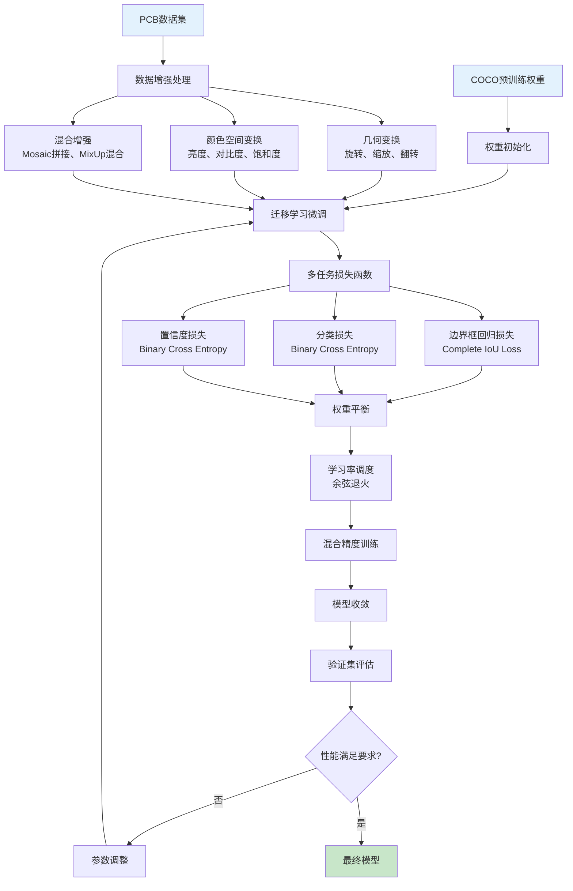
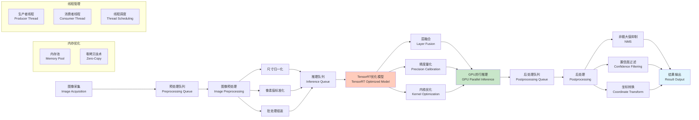

## YOLOv11整体网络架构图
```mermaid
## 锚框配置优化流程图
```mermaid
graph TD
    A[输入图像<br/>Input Image] --> B[骨干网络<br/>Backbone Network<br/>CSPDarknet]
    
    B --> C1[浅层特征<br/>Shallow Features]
    B --> C2[中层特征<br/>Middle Features]
    B --> C3[深层特征<br/>Deep Features]
    
    C1 --> D[特征融合网络<br/>Feature Fusion Network<br/>FPN + PAN]
    C2 --> D
    C3 --> D
    
    D --> E1[小目标检测头<br/>Small Object<br/>Detection Head]
    D --> E2[中目标检测头<br/>Medium Object<br/>Detection Head]
    D --> E3[大目标检测头<br/>Large Object<br/>Detection Head]
    
    E1 --> F1[分类分支<br/>Classification<br/>Branch]
    E1 --> G1[回归分支<br/>Regression<br/>Branch]
    E1 --> H1[置信度分支<br/>Confidence<br/>Branch]
    
    E2 --> F2[分类分支<br/>Classification<br/>Branch]
    E2 --> G2[回归分支<br/>Regression<br/>Branch]
    E2 --> H2[置信度分支<br/>Confidence<br/>Branch]
    
    E3 --> F3[分类分支<br/>Classification<br/>Branch]
    E3 --> G3[回归分支<br/>Regression<br/>Branch]
    E3 --> H3[置信度分支<br/>Confidence<br/>Branch]
    
    F1 --> I[非极大值抑制<br/>Non-Maximum Suppression]
    F2 --> I
    F3 --> I
    G1 --> I
    G2 --> I
    G3 --> I
    H1 --> I
    H2 --> I
    H3 --> I
    
    I --> J[检测结果<br/>Detection Results]
    
    style A fill:#e1f5fe
    style B fill:#f3e5f5
    style D fill:#e8f5e8
    style I fill:#fff3e0
    style J fill:#ffebee
```
graph TD
    A[3000张PCB训练图像] --> B[元器件标注数据提取]
    B --> C[尺寸分布统计分析]
    C --> D[K-means聚类算法]
    D --> E[确定三个主要尺度范围]
    E --> F[生成9个最优锚框尺寸]
    F --> G[坐标注意力机制集成]
    G --> H[多尺度训练策略]
    H --> I[优化后的YOLOv11模型]
    
    C --> C1[小尺寸元件<br/>0.5-2mm]
    C --> C2[中等尺寸元件<br/>2-8mm]
    C --> C3[大尺寸元件<br/>8-20mm]
    
    F --> F1[小目标锚框<br/>8×8, 16×16, 32×32]
    F --> F2[中目标锚框<br/>64×64, 128×128, 256×256]
    F --> F3[大目标锚框<br/>512×512, 1024×1024, 2048×2048]
    
    style A fill:#e3f2fd
    style D fill:#f3e5f5
    style I fill:#e8f5e8
```

## 训练流程图


## 推理管道架构图

