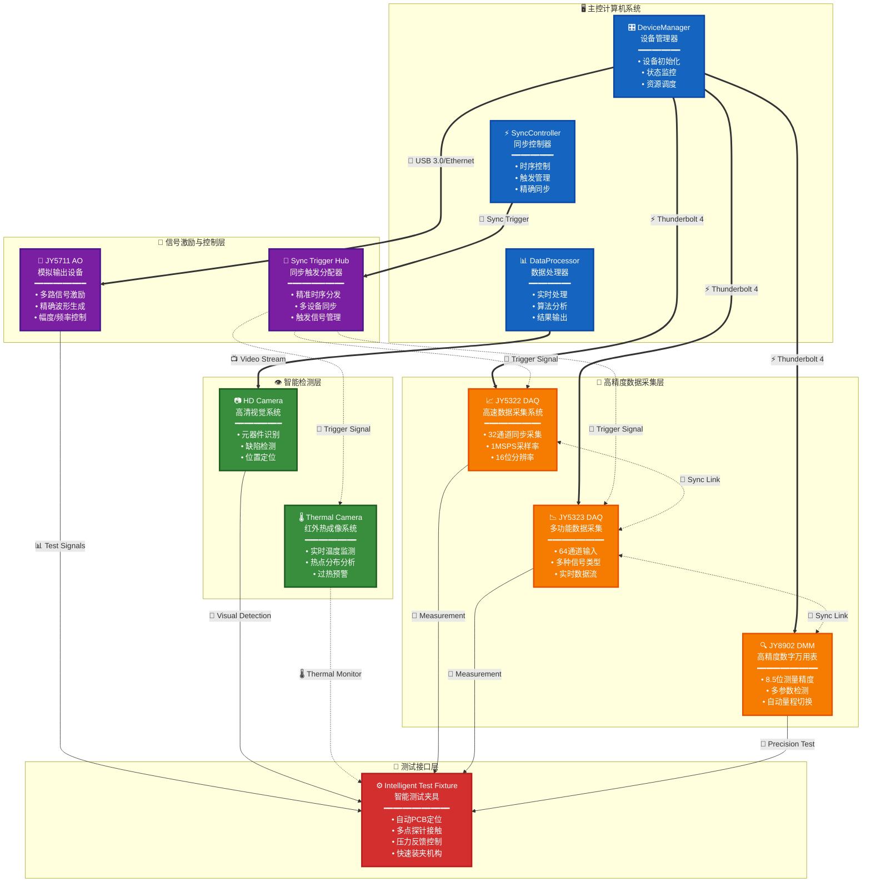

# 硬件系统架构图

## Mermaid格式

## 使用说明

1. 复制上面的Mermaid代码
2. 访问 https://mermaid.live/
3. 将代码粘贴到左侧编辑器中
4. 右侧会实时显示生成的图形
5. 可以导出为PNG、SVG等格式

## 其他格式选项

如果您需要其他格式，我也可以为您生成：
- PlantUML格式
- Graphviz格式
- 或者直接生成HTML文件 