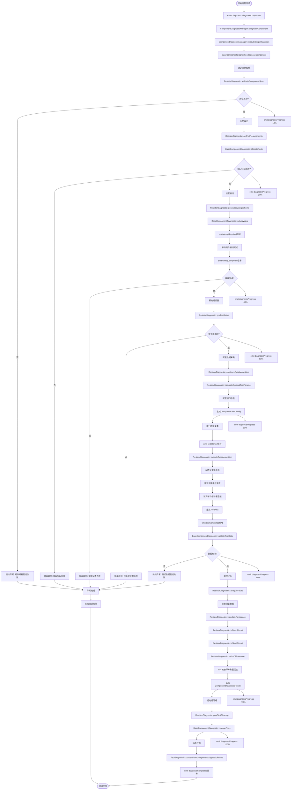

# 电阻测试整个流程图

## 流程概述
电阻测试流程基于新的组件诊断框架（ComponentDiagnosticFramework），以调用的函数为节点展示完整的测试链路。

## 详细流程图

## 关键函数调用链

### 1. 主入口函数
- `FaultDiagnostic::diagnoseComponent(ComponentSpec)`
- `ComponentDiagnosticManager::diagnoseComponent(ComponentSpec)`
- `BaseComponentDiagnostic::diagnoseComponent(ComponentSpec)`

### 2. 电阻器专用诊断器函数
- `ResistorDiagnostic::validateComponentSpec()` - 验证组件规格
- `ResistorDiagnostic::getPortRequirements()` - 获取端口需求
- `ResistorDiagnostic::generateWiringScheme()` - 生成接线方案
- `ResistorDiagnostic::preTestSetup()` - 预测试设置
- `ResistorDiagnostic::configureDataAcquisition()` - 配置数据采集
- `ResistorDiagnostic::executeDataAcquisition()` - 执行数据采集
- `ResistorDiagnostic::analyzeFaults()` - 故障分析

### 3. 测试参数计算函数
- `ResistorDiagnostic::calculateOptimalTestParams()` - 计算最优测试参数

### 4. 数据采集核心函数
- `ResistorDiagnostic::calculateResistance()` - 计算电阻值

### 5. 故障检测函数
- `ResistorDiagnostic::isOpenCircuit()` - 开路检测
- `ResistorDiagnostic::isShortCircuit()` - 短路检测  
- `ResistorDiagnostic::isOutOfTolerance()` - 容差检测

### 6. 后处理函数
- `ResistorDiagnostic::postTestCleanup()` - 测试后清理
- `BaseComponentDiagnostic::releasePorts()` - 释放端口

### 7. 结果转换函数
- `FaultDiagnostic::convertFromComponentDiagnosticResult()` - 结果格式转换

## 测试数据流

### 输入数据
- `ComponentSpec` 组件规格（标称值、容差、引脚等）

### 中间数据
- `PortRequirement[]` 端口需求列表
- `WiringConnection[]` 接线连接方案
- `ComponentTestConfig` 测试配置参数
- `TestData` 原始测试数据（电压、电流、时间戳）

### 输出数据
- `ComponentDiagnosticResult` 诊断结果
- `DiagnosticResult` 兼容格式结果

## 信号流

### 进度信号
- `diagnosisStarted(componentId)` - 诊断开始
- `diagnosisProgress(componentId, percentage)` - 诊断进度
- `diagnosisCompleted(componentId, result)` - 诊断完成

### 接线信号
- `wiringRequired(componentId, connections)` - 需要接线
- `wiringCompleted(componentId)` - 接线完成

### 测试信号
- `testStarted(componentId)` - 测试开始
- `testCompleted(componentId, testData)` - 测试完成

## 异常处理

所有关键步骤都有异常检查和处理机制：
1. 组件规格验证失败
2. 端口分配失败
3. 接线设置失败
4. 预处理设置失败
5. 测试数据验证失败

异常发生时会：
- 释放已分配的资源
- 生成错误结果
- 发出错误信号
- 返回错误状态

## 测试流程特点

1. **模块化设计** - 每个步骤由专门的函数负责
2. **信号驱动** - 通过Qt信号系统进行进度通知
3. **异常安全** - 完善的错误处理和资源清理
4. **可扩展性** - 基于虚函数的继承体系
5. **向后兼容** - 保持与旧版本API的兼容
